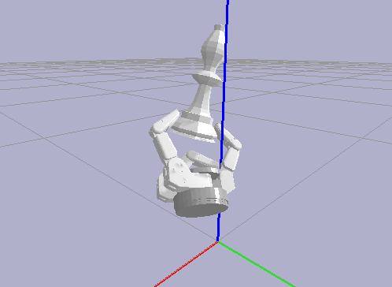

# Barrett grasp dataset

__Description__

The content is a growing dataset that includes grasps of Barrett hand over [Princeton Shape Benchmark](https://shape.cs.princeton.edu/benchmark/)(PSB) which includes more than 1800 3D models. This is a public dataset similar to [Columbia Grasp Database](http://grasping.cs.columbia.edu/). The grasps will be collected in five different scales that result in 5 * 1800 models for the training set. The grasps extracted using [graspit! ROS interface](https://github.com/graspit-simulator/graspit_interface). In order to get more reliable grasps applicable in the real world the grasps will go through gravity and disturbance check. To do so, bullet physics engine is used to simulate the grasps under more real physical and mechanical conditions see [pybullet](https://github.com/bulletphysics/bullet3).

__Strucrture__

The dataset is available in the CSV format but the final dataset would be in .hdf5 or .pkl or SQL database. Headers are defined as follows:

**'3d_model_name'**: Name of model assigned to models in the PSB.

example: m0_70, m454_100, m120_125

_75, _100, _125 indicates the scale of the mesh object regarding the original model in the PSB. Note that models in PSB are small, therefore, to scale them in the range of graspable object for Barrett hand, five scales, (1 / scl) * 75, (1 / scl) * 100, (1 / scl) * 125, (1 / scl) * 150, (1 / scl) * 175 are used for rescaling.

**'hand_position'**: The hand position coordinates regarding the number of grasps found for an object

example: [[x1, y1, z1], [x2, y2, z2], ...]

Note: a single 3D model could contain more than one grasp.

**'hand_orientation'**: The orientations around the x, y, z axes

example: [[x1, y1, z1, w1],[x2, y2, z2, w2], ...]

Note: x, y, z are vectors indicating the rotation axis and w is the angle of rotation around the axis

**'finger_dofs'**: Joint angles of Barrett's hand with four DOF

example: [[a1, a2, a3, a4], [b1, b2, b3, b4], ...]

**'contacts_number'**: The number of hand contacts with the object

example: [c1, c2, c3, ...]

**'contacts_position'**: The positions of contacts

example: [[[x1, y1, z1], [x2, y2, z2], ...], [[x3, y3, z3], [x4, y4, z4], ...]]

Note: the length of contacts_position is equal to contacts_number for a specific object

**'contacts_orientation'**: The orientations of contacts

example: [[[x1, y1, z1, w1],[x2, y2, z2, w2], ...], [[x1, y1, z1, w1],[x2, y2, z2, w2], ...]]

**'grasps_epsilon_quality'**: Ferrari-Canny grasp epsilon quality

example: [eps1, eps2, eps3, ...]

Note: this is a parameter for evaluating good and bad grasps based on external perturbation in **gdataset** grasps with eps > 0.04 are considered as good grasps

**'grasps_volume_quality'**: Grasp volume quality, the volume of the wrenches space's convex hull

example: [vol1, vol2, vol3, ...]

**'grasps_energy_quality'**: The energy to drive the hand towards reachable hand configuration including contact energy and potential energy. Contact Energy defines the proximity of the hand to the object being grasped while the potential energy captures the quality of grasp in terms of force closure analysis

example: [G1, G2, G3, ...]

**'mass'**: The mass of an object in gram. All objects are considered that they made of plastic with a density 991 kg/m^3 that is a little smaller than water density

**'inertia_matrix'**: Inertia matrix of a given object

example: [[Ixx, Ixy, Ixz],[Iyx, Iyy, Iyz], [Izx, Izy, Izz]]

**'max_ball_reduce'**: Maximum radius originated from the mass center of an object to its surface

__Gravity Check__

The following figures show the process of grasp gravity check for m1159 and m111

__Visualization__

The following images are three samples of the dataset. Run graspit! ROS interface and use the tester.py

 

 

__References__

Corey Goldfeder et all, "The Columbia grasp database", 2009 IEEE International Conference on Robotics and Automation, 12-17 May 2009

Andrew Miller and Peter K. Allen. "Graspit!: A Versatile Simulator for Robotic Grasping". IEEE Robotics and Automation Magazine, V. 11, No.4, Dec. 2004, pp. 110-122

